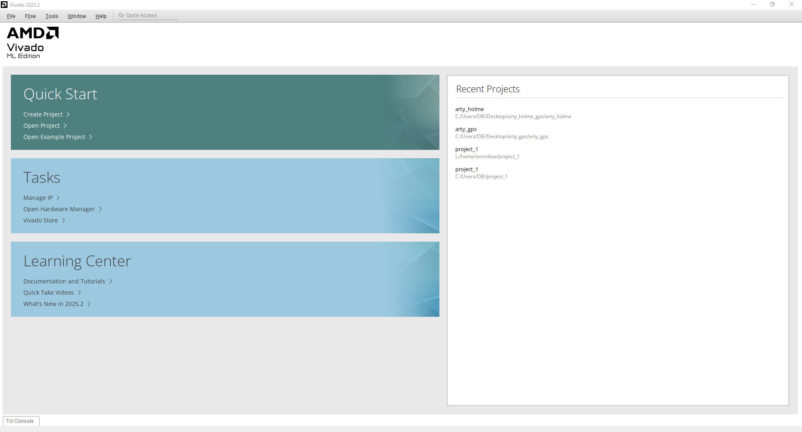
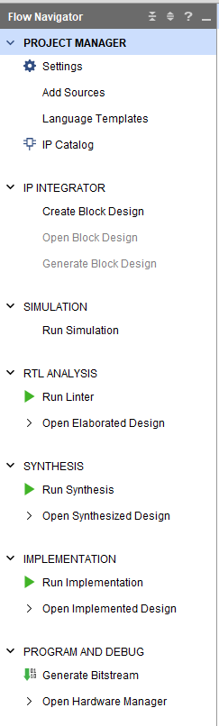
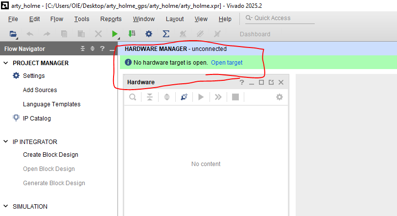

### 1.Open Vivado 

Clicl on arty_holme in the right hand side pane
### 2. After Connecting the fpga to the laptop , Click "Open Hardware Manager" in the Flow navigator pane

### 3. Click on open target and auto connect

### 4. Click program device

### 5. Make sure the bit stream file is the same as in the image and click program

## IMPORTANT
If the FPGA disconnected you have to reprograme it 
