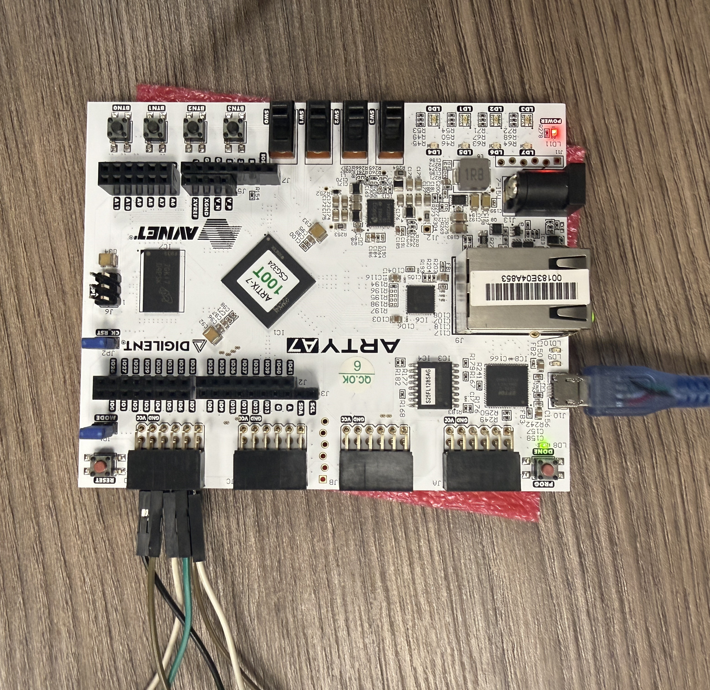
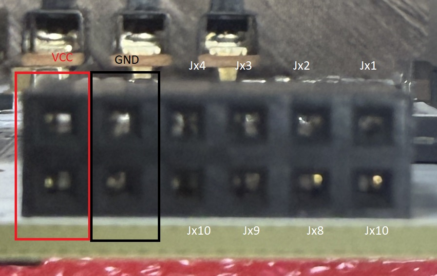
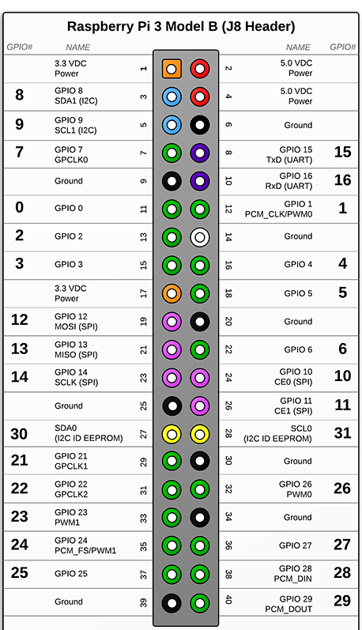

## How to read this guide 
First keep the fpga's ethernet port on your right

As you can see the Image there 4 big bottom ports
JA JB JC and JD. (JA is on the right)

Now, to read the headers refer the guide below again keeping the ethernet port on your right(x can be D or B)

## 1. Streaming Device → FPGA  (the sample injection)
 
Two wires only — one signal, one ground.
 
| Signal | Streaming Device | FPGA (Arty A7) |
|--------|------------------|----------------|
| Sample data | pin | `IF_P` —  Pmod **JB1** (pin **E15**) |
| Ground | GND | GND (Pmod JB GND pin) |
 ## 2. Raspberry Pi → FPGA  (command + control link)
(Ignore the FPGA PINS the Pmod is the important one)

 **Pmod JD — Raspberry Pi SPI**
| Pmod pin | PI phys pin | Signal |
|----------|----------|--------|
| JD1 | 24 | `RPI_CS_N[0]` |
| JD2 | 26 | `RPI_CS_N[1]` |
| JD3 | 23 | `RPI_SCLK` |
| JD4 | 19 | `RPI_MOSI` |
| JD7 | 21 | `RPI_MISO` |
| JD GND | — | ground |

Read the physical pins not the GPIO numbers
