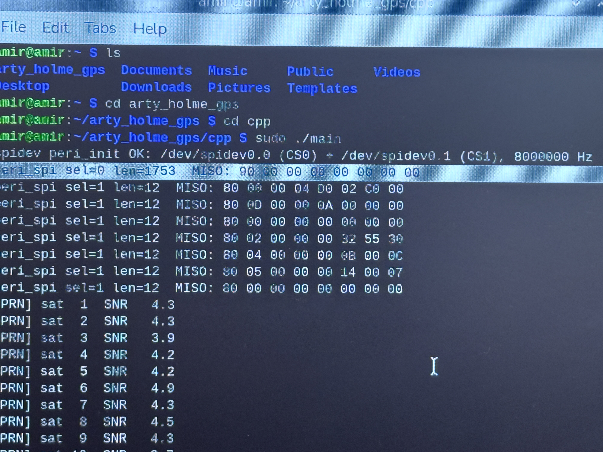
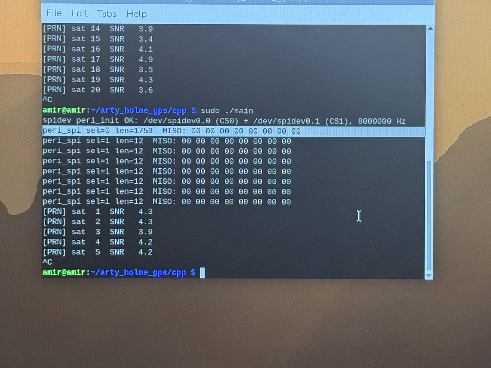

### Startup the PI
### Make sure the fpga is connected to the PI as stated in the hardware guide 
### Move to the project directory
```bash
cd arty_holme_gps
```
### Move to the CPP folder 
```bash
cd cpp
```
### Run the main file 
```bash
sudo ./main
```
password: 12345678

### Either of two things will happen

If the first output is not all zeroes like in the picture above then the FPGA is successfully communicating with the PI

Otherwise it will all be zeroes like below
